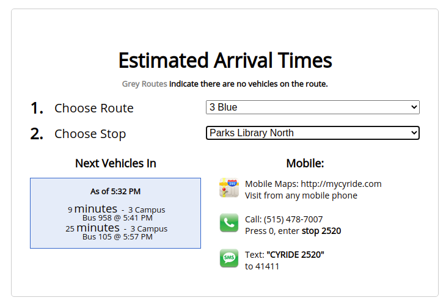

# MMM-CyRide

A [Magic Mirror](https://github.com/MichMich/MagicMirror) module to show upcoming CyRide routes near your location. CyRide is the public bussing system in Ames, IA home of Iowa State University. Go Cyclones!

## Installation

To install MMM-CyRide, open the modules folder of your `MagicMirror` installation. Run the following command:

- `git clone https://github.com/patrickdemers6/MMM-CyRide.git`

There are no external dependencies for this module.

To finish adding the module, follow the configuration settings below.

## Configuration

Add the following code to your Magic Mirror's `config.js` file's `modules` array.

```
{
module: "MMM-CyRide",
position: "top_left", // customize to the position you want
config: {
    stopID: 'ID OF STOP TO MONITOR',
    }
}
```

### Find your Stop ID
To find your stop's ID, use this website [on this website](https://mycyride.com/arrivals). Choose a route that passes the relevant stop, then choose your stop from the list of stops. The stop ID is listed in bold after choosing a route and stop. In the image below, the stop ID is 2520.



## Contributing
PRs welcome!

To develop on your local machine, install this module like normal (you may like to clone your own fork's code). Then, start your magic mirror install by running `npm start &`. This will show node_helper output in the terminal. Then, access your magic mirror and make the magic happen!